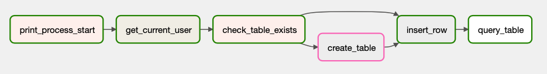
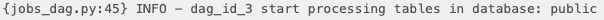
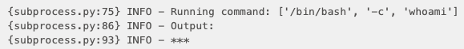
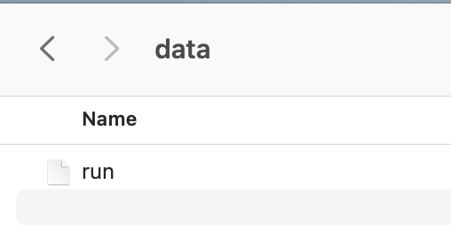
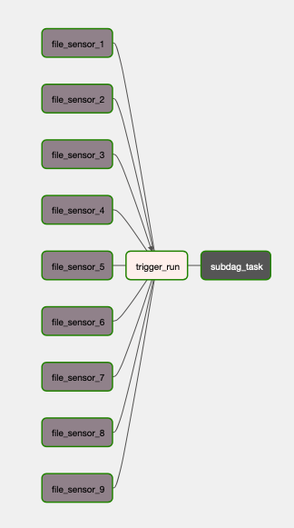
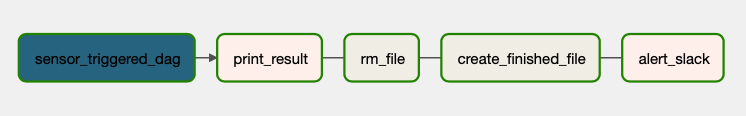
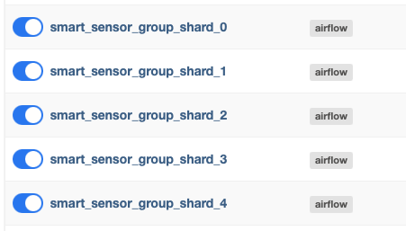
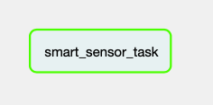

# airflow project

This is a simple Capstone Project to get to know Airflow functionalities and capabilities. It was build through the modules of the GridU Apache Airflow course. It includes the use of DAGs, tasks, operators, branching, subDAGs, and connections.

## the important concepts

### DAGs

Airflow DAGs are workflows that can be defined and orchestrated in Airflow. They consist of a set of tasks that need to be executed in a particular order, with each task representing a unit of work and the dependencies between tasks representing the order in which they need to be executed. To document a DAG, key pieces of information that should be included are the DAG name, description, schedule, default arguments, tasks, dependencies, and author/contact information. This documentation makes it easier for users to understand the purpose and functionality of the DAG and modify it as needed.

### tasks

Tasks in are individual units of work that need to be executed and are defined using various operators such as BashOperator, PythonOperator, or SQLOperator. Tasks can have dependencies on other tasks within the same DAG, and these dependencies determine the order in which tasks are executed. Additionally, tasks can have other attributes such as retries, timeout, priority_weight, queue, and pool. By defining tasks and their dependencies within a DAG, Airflow can automatically execute the tasks in the correct order, manage retries and timeouts, and handle task failures, making it easier to manage complex workflows and ensure that all tasks are completed successfully.

### operators

Operators are building blocks for defining tasks within a DAG. They define the actual work that needs to be done and are specific to the type of task, such as running a shell command or executing a Python function. Operators can be chained together to define the dependencies between tasks, and Airflow allows for custom operators to be defined for greater flexibility.

#### custom operators

Custom operators allow users to define their own operators for performing tasks not covered by built-in operators. Users can create a new Python class that inherits from an existing operator class and customize it with specific functionality. This provides greater flexibility and enables users to create tailored operators for their specific needs.

### branching

Branching allows for conditional execution of tasks within a DAG. The `BranchPythonOperator` executes a Python function that returns the ID of the next task to execute based on the result of the previous task. This enables the creation of complex workflows with multiple paths based on task outcomes.

### subDAGs

SubDAGs allow for modularization and code reuse within a DAG. They group a set of tasks into a smaller workflow that can be added to the main DAG as a single task. SubDAGs simplify complex workflows and improve code maintainability by reducing duplication.

### connections

# the structure of the project

## DAGs

### jobs DAG

This is the main DAG, the one that has the tasks that access the database and works with the tables of the connection. The general structure of it looks like this:

It consists of the following tasks:

1. `print_process_start`: PythonOperator that logs to console the start of the process.

2. `get_current_user`: BashOperator that runs `whoami` command inside terminal to read user name.

3. `check_table_exists`: BranchPythonOperator that checks wether the schema already contains a table to register users and chooses if it should skip or not the task that creates the table.
4. `create_table`: PostgresOperator that creates a table inside the schema of Postgres to be able to later insert registers.
5. `insert_row`: PostgresOperator that inserts a row in the table with the user obtained by the bash operator including and ID and the registration date.
6. `query_table`: PostgresOperator that queries the filled table to read all the rows and log them.

### trigger DAG

This DAG is in charge of waiting for the file `run` to be inside the `data` path.

Once it finds the file, triggers the other DAG and runs other tasks inside its subGAD.

#### subDAG

The trigger DAG's subDAG task is conformed by multiple tasks that work with reading, logging and managing the process of the main DAG (the `jobs_dag`) and basically consists in making sure everything is working as expected and letting the user know that.

Its tasks are:
1. `sensor_triggered_dag`
2. `print_result`
3. `rm_file`
4. `create_finished_file`

### sensor DAGs

There are multiple sensor DAGs in the project, they are in charge of checking wether the necessary file is where it is suposed to be in the path.

The only task this DAGs contain is to sensor, so they are quite simple DAGs.

